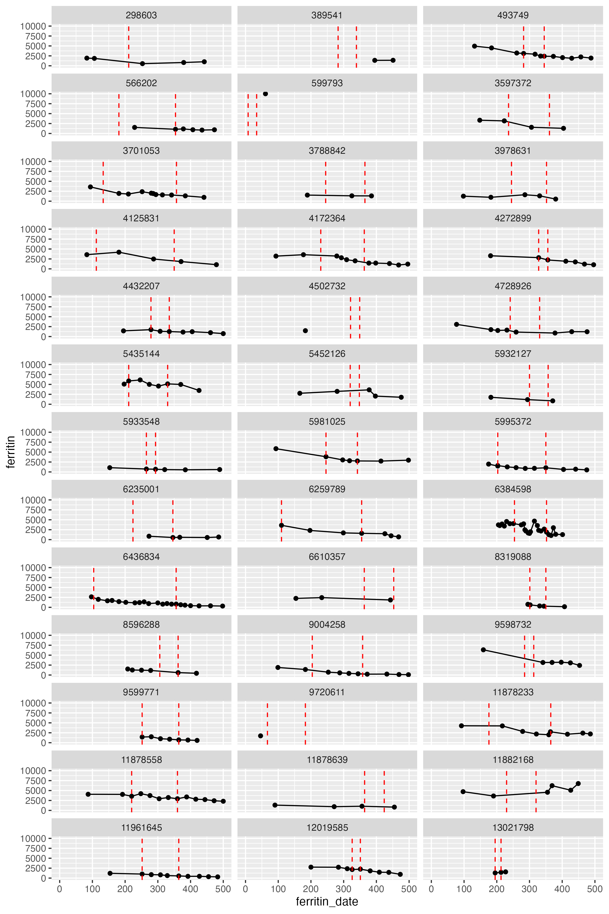

```{r setup, include=FALSE}
knitr::opts_chunk$set(echo = FALSE, message = FALSE, warning = FALSE, fig.width = 10, fig.height = 6, fig.align = "center")
# Default taken from R notebook behavior: when knitting, wd will always be location of notebook
base_dir <- '..'
Sys.setenv(db_version = "5.1")
Sys.setenv(PEDSNET_SKIP_REQUEST_EXECUTION=1)
Sys.setenv(db_version = "5.1")

tryCatch(source('../site/run.R'),
         error = function (e) message(e)) # May not be able to make db connection

# Set to "local" to read data from ../results, or another value to read from db
data_source <- "not_local" #if_else(config('execution_mode') == 'distribution', 'local', 'not_local')

require(tidyr)
require(knitr)
require(kableExtra)
require(stringr)
require(tibble)
require(ggplot2)
require(table1)
require(tidyverse)
require(ggpubr) #linear fit 
```

```{r functions, include=FALSE}
get_codesets <- function(codeset_name) {
  read_csv(paste0('../specs/', codeset_name, '.csv'), col_types = c('c', 'c', 'c', 'c'), show_col_types = FALSE) %>%
  mutate(concept_id = as.character((concept_id)), concept_code = as.character((concept_code))) %>% collect()
}

get_results <- function(tbl_name) {
  if (data_source == 'local') {
    rslt <- read.csv(paste0('../local/', tbl_name, '.csv'))
  }
  else {
    rslt <- results_tbl(tbl_name) %>% collect()
  }
  rslt
}

prettify_kable <- function(data) {
  rslt <- data %>% kable(digits = 4, format.args = list(big.mark = ','))
  if (knitr::is_html_output()) rslt <- rslt %>%
      kable_styling(bootstrap_options = c("striped", "hover")) %>%
      column_spec(1, bold = T, border_right = T)
  rslt
}

my.render.cont <- function(x) {
    with(stats.apply.rounding(stats.default(x), digits=2), c("",
        "Median (IQR)"=sprintf("%s [%s, %s]", MEDIAN, Q1, Q3)))
}

pvalue <- function(x, ...) {
    # Construct vectors of data y, and groups (strata) g
    y <- unlist(x)
    g <- factor(rep(1:length(x), times=sapply(x, length)))
    no_groups = length(unique(g))

    if (is.numeric(y) & no_groups == 2) {
        # For numeric variables, perform a standard 2-sample t-test
        p <- t.test(y ~ g)$p.value
    } else if (is.numeric(y) & no_groups >2) {
        # For numeric variables with more than 2 populations perform an anova tests
        anova_result <- aov(y ~ g)
        p <- summary(anova_result)[[1]][["Pr(>F)"]][1]
    } else {
        # For categorical variables, perform a chi-squared test of independence
        p <- chisq.test(table(y, g))$p.value
    }
    # Format the p-value, using an HTML entity for the less-than sign.
    # The initial empty string places the output on the line below the variable label.
    c("", sub("<", "&lt;", format.pval(p, digits=3, eps=0.001)))
}

# compute proportion of VOD varried by ferritin or LIC cutoff

vod_prop_calculation <- function(df, iron_var){

  # min_val = round(min(df %>% select(ferritin), na.rm = TRUE))
  # max_val = ceiling(max(df %>% select(ferritin), na.rm = TRUE))

  min_val = min(df %>% select({{iron_var}}), na.rm = TRUE)
  max_val = max(df %>% select({{iron_var}}), na.rm = TRUE)

  total = nrow(df)
  iron_val = seq(min_val,max_val, by =1)
  prop = rep(NA, length(iron_val)) 
  # prop[,1] = iron_val  

  for(i in 1:1:length(iron_val)){
    prop[i] <- nrow(df %>% select({{iron_var}}) %>% filter({{iron_var}} >= iron_val[i]))/total #{{iron_var}}
  }

  return (data.frame(cutoff = iron_val, prop = prop))
}
```

```{r report_recap, echo=FALSE, message=FALSE, warning=FALSE, paged.print=FALSE}
tribble( ~Item, ~Value,
         'Title', config('title'),
         'PI', config('requester_name'),
         'CDM Version', as.character(config('cdm_version'))) %>%
  prettify_kable()

```
```{r data, include= FALSE}
cohort <- results_tbl("study_cohorts") %>%
                    pivot_longer(cols = aim_2a_2:aim_3_2, names_to = "aim", values_to = "which_aim") %>% 
                    filter(which_aim == TRUE) %>% 
                    collect() %>%
                    mutate(age_at_ce = round(as.numeric(difftime(transplant_date, birth_date, units = "days"))/365.25)) %>%
                    # mutate(transplant_type = case_when(grepl("allogeneic", transplant_concept_name, ignore.case = TRUE) ~ "allogeneic",
                    #                           grepl("autologous", transplant_concept_name, ignore.case = TRUE) ~ "autologous",
                    #                           TRUE ~ "unknown")) %>% 
                    select(person_id, aim, site, age_at_ce , gender, scd_concept_name, scd_type, transplant_concept_name, transplant_type, transplant_date)
cohort_ct <- cohort %>% distinct_ct()
```

**Confidentiality:** Please treat the contents of this report as confidential, and do not redistrubute beyond PEDSnet staff and the requester.

# Cohort Definition

-   **Time Anchors:** The specific details of cohort formation are described below. Note that for dates, we use notation to indicate time, where 0 refers to the day that a patient enters the cohort, a positive integer refers to the number of days after the cohort entrance that the observation period lasts, a negative interger refers to the number of days before the cohort entrance that the observation period lasts, oo refers to the end of the study period, and -oo refers to the beginning of the study period.

-   **Study period:** 1/1/2010 – 6/30/2023, specifically:
    - Aim 2a: 1/1/2010 – 6/30/2023
    - Aim 2b & 3: 1/1/2010 – 12/31/2022

-   **Cohort entrance date:** Date of first transplant

-   **Follow-up window:** 
    - Interval during which outcome(s) of interest may be included in the analysis: [-365, 00].
    - Exposures of interest (LIC, ferritin) for Aims 2a can be observed from -365 days to 0.
    - Exposures of interest (LIC, ferritin) for Aims 2b and 3 can be observed from day +90 to +365.
    - Exposures of interest (deferasirox or deferoxamine prescription, phlebotomy procedure) for Aim 3 can be observed from day +90 to 00. 
    - Outcomes of interest for Aim 2a can be observed from day 0 to 00 
    - Outcomes of interest for Aim 2b can be observed from date of post-transplant LIC or ferritin to 00. 
    - Outcomes of interest for Aim 3 can be observed from date of prescription of deferasirox or deferoxamine to 00, or date of first phlebotomy to 00

-   **Inclusion/exclusion criteria:** 
    - Aim 1: Pre-HSCT iron overload: Exclude patients who do not have either a pre-HSCT ferritin or LIC. Post-HSCT iron overload: exclude patients who do not have an LIC or ferritin 6-12 months after HSCT. 
    - Aim 2a: Include patients whose first transplant between 1/1/2010 – 6/30/2023. Exclude patients who do not have either a pre-HSCT ferritin or LIC. 
    - Aim 2b and 3: Include patients whose first transplant between 1/1/2010 – 12/1/2022. Exclude patients who do not have an LIC or ferritin 6-12 months after HSCT. 
    - Aim 3: Exclude patients who did not require post-transplant chelation or phlebotomy.

# Variable definition:
- **LIC level**:
  - Low: <5 mg Fe/g dry wt
  - Moderate: [5, 8] mg Fe/g dry wt
  - High: >8 mg Fe/g dry wt
  - Binary classification: Low: <8 mg Fe/g dry wt and High otherwise
- **Ferritin level**:
  - Low: <1000 ng/mL 
  - Moderate: 1000-2500 ng/mL 
  - High: >=2500 ng/mL 
- **Immune reconstitution**: 
  - CD3 count >500
  - CD4 count >200 
  - CD8 count >200
  - IgM >25. 
- **VOD**: (as of 01/10/2025)
  - **(1)** (Prescription of defibrotide after transplant date AND Abdominal ultrasound within 2 days) within 30 days of transplant. 
  - ~~**(2)** (Abdominal ultrasound AND total bilirubin >2 mg/dL within 3 days) within 90 days of transplant~~ --- old definition, no longer used 
  OR 
  - **(3)** (Abdominal ultrasound AND total bilirubin >2 mg/dL within 2 days AND significant weight gain defined as: weight gain on 3 consecutive measurements within 10 days of ultrasound OR weight gain >5% of admission weight within 10 days of ultrasound) within 30 days of transplant
  OR
  - **(4)** Peritoneal drain placement procedure during transplant admission
(this should show up as a procedure code during admission) --- new criterion 
  OR 
  - **(5)** Veno-occlusive disease (VOD) or sinusoidal obstruction syndrome (SOS) on patient problem list --- new criterion

- **Neutrophil Engraftment**: The first of 3 successive days with an absolute neutrophil count (ANC) of 500/uL after post-transplantation nadi (Nadir usually occurs within 7-14 days after date of transplant) 
- **Platelet engraftment**: The first of 3 consecutive days with a platelet count of 20,000/uL or higher in the absence of platelet transfusion for 7 consecutive days. 
- **Primary graft failure**: 
  - Must have not met criteria for neutrophil engraftment or platelet engraftment previously
  - ANC <500/uL by day +28 after transplant AND hemoglobin < 8g/dL AND platelets < 20,000/uL 
- **Secondary graft failure**: 
  - Must have NOT met the requirement for primary graft failure 
  - Requirement for red blood cell or platelet transfusions, or need for G-CSF medication (growth colony stimulating factor --- normally given by injections) AFTER meeting criteria for neutrophil or platelet engraftment previously 

# Conditions and Procedure Codesets:
-   A compehensive code search was performed for all the conditions, procedures, and measurements specified in the DAP. The list of codesets could be found [here](https://chop365.sharepoint.com/teams/RSCH-ACRC/Shared%20Documents/Forms/AllItems.aspx?id=%2Fteams%2FRSCH%2DACRC%2FShared%20Documents%2FPEDSnet%2FPEDSnet%20Studies%2FActive%20Studies%2FGibson%5FIron%20Overload%2FQueries%2FCodesets%5F2024Feb27&viewid=fbc819dd%2Dfbe7%2D4805%2Da6fc%2D03eda92856f5).

# Transplant types and donor relationship
- Transplant types and donor relationship are combined into a single variable
  - Category 1: Matched related donor (related, 10/10 or 8/8)
  - Category 2: Matched unrelated donor (unrelated, 10/10 or 8/8)
  - Category 3: Mismatched unrelated donor (includes 8/10, 9/10, 7/8) 
  - Category 4: Haploidentical 
  - Category 5: Mismatched related donor (includes 8/10, 9/10, 7/8) 
  - Category 6: Cord (related or unrelated)
  - Category 7: Autologous (no donor)

# Result Summary

- <span style="background-color: #FFFF00"> For patients without chart review data, we use date of first transplant from EHR as cohort entry (CE)</span>. 

- The provisional cohort comprises `r format(cohort_ct, big.mark = ",")` patients from `r summarise(cohort, ct = n_distinct(site)) %>% pull(ct)` PEDSnet sites for all 3 Aims.
    - Chart review data include `r cohort %>% filter(aim != "aim_3_1", aim != "aim_3_2") %>% distinct_ct()` patients from aim 2a and 2b of this cohort and an additional n = 16 patients whose transplant dates and number of transplants were not verifiable from EHR data. 
    - The columns are not mutally exclusive as patients could be eligible for multiple aims. 

# Chart review 
## Chart review progress
```{r cohort_covars_run, echo= FALSE, message=FALSE, results='hide'}
cohort_covars <- results_tbl("analytics_dataset") %>% collect() 
```

```{r cr_progress, echo= FALSE, message=FALSE, results='hide'}
cr_data_raw <- read.csv("../redcap/IronOverloadChartRev_DATA_2024-11-26_2219.csv") %>% 
            # filter out old patient ids
           filter(!grepl("^[A-Za-z]", record_id)) %>% rename(site = redcap_data_access_group)
total_cr_ct <- cr_data_raw %>% distinct_ct("record_id")

# cleaned data
# cr_data <- get_redcap_data(redcap_filename = "../redcap/IronOverloadChartRev_DATA_2024-11-08_1206.csv") %>%
#             mutate(second_transplant = if_else(!is.na(second_transplant_date), TRUE, FALSE))
cr_data <- results_tbl("cr_data") %>% collect() %>%
            mutate(second_transplant = if_else(!is.na(second_transplant_date), TRUE, FALSE))
completed_cr_ct <- cr_data %>% distinct_ct("record_id")
true_positives_cr_ct <- cr_data %>% filter(eligibility == "Yes") %>% distinct_ct("record_id")
false_positives_cr_ct <- cr_data %>% filter(eligibility == "No") %>% distinct_ct("record_id")

# among chart reviews patients, how many had leukemia
leukemia_dx_px <- results_tbl(name = "leukemia_dx_px") %>% collect()
cr_data_w_leukemia <- cr_data %>% distinct(record_id, eligibility) %>%
                        left_join(results_tbl("study_cohorts")%>% select(person_id, record_id) %>% collect(), by = c("record_id")) %>%
                        inner_join(leukemia_dx_px, by = "person_id") %>%
                        distinct(record_id, eligibility, person_id) 

false_positives_cr_w_leukemia_ct <- cr_data_w_leukemia %>% filter(eligibility == "No") %>% 
                        distinct_ct("record_id")
true_positives_cr_w_leukemia_ct <- cr_data_w_leukemia %>% filter(eligibility == "Yes") %>% 
                        distinct_ct("record_id")
true_positives_cr_w_leukemia_prior_ct <- cohort_covars %>% filter(eligibility == "Yes") %>%
                        filter(leukemia_prior) %>%
                        distinct_ct("record_id")
# completed_cr_w_leukemia_ct <- r_data_w_leukemia %>% distinct_ct("record_id")
cr_w_leukemia_ct <- cr_data_raw %>% distinct(record_id) %>% left_join(results_tbl("study_cohorts")%>% select(person_id, record_id) %>% collect(), by = c("record_id")) %>%
                        inner_join(leukemia_dx_px, by = "person_id") %>%
                        distinct_ct("record_id")

# number of true positives with matched transplant dates
true_positves_matched_dates_ct <- cohort_covars %>% filter(transplant_date_consistency ==1) %>% filter(eligibility == "Yes") %>% distinct_ct()                       
```

- Total number of chart reviews: `r total_cr_ct`
  - Number of patients with leukemia in this cohort: `r cr_w_leukemia_ct`
- Number of completed chart reviews: `r completed_cr_ct` (`r round(completed_cr_ct/total_cr_ct*100)`%)
- Number of false positives: `r false_positives_cr_ct` (`r round(false_positives_cr_ct/total_cr_ct*100)`%)
  - <span style="background-color: #FFFF00">Number of false positives with leukemia: `r false_positives_cr_w_leukemia_ct` (`r round(false_positives_cr_w_leukemia_ct/false_positives_cr_ct*100)`% of total false positives) </span>
- Number of true positives: `r true_positives_cr_ct` (`r round(true_positives_cr_ct/total_cr_ct*100)`%)
  - <span style="background-color: #FFFF00"> Number of true positives with leukemia: `r true_positives_cr_w_leukemia_ct` (`r round(true_positives_cr_w_leukemia_ct/true_positives_cr_ct*100)`% of total true positives). Among these patients, n = `r true_positives_cr_w_leukemia_prior_ct` had leukemia diagnosed before transplants.</span>
  - Number of true positives with transplant dates correctly idenftified by PEDSnet EHR (withnin 3 days): n = `r true_positves_matched_dates_ct` (`r round(true_positves_matched_dates_ct/true_positives_cr_ct*100)`% of total true positives)

- <span style="background-color: #FFFF00">For cases when no. true positives and total valid charts dont match, due to the pending LIC/Ferritin values awaiting confirmation from Nora. In the final analytic dataset, the 2 columns should match </span>. 
```{r cr_progress_by_site}
# count false positives, true positives, num complted and num total for each site
cr_completion_by_site <- cr_data %>% group_by(site, eligibility) %>% 
      summarise(n = n_distinct(record_id)) %>% ungroup() %>%
      mutate(eligibility = if_else(eligibility == "No", "n_false_positives", "n_true_positives")) %>%
      # total counts per site
      union(cr_data_raw %>% group_by(site) %>% summarise(n = n_distinct(record_id)) %>% ungroup() %>% mutate(eligibility = "n_total")) %>%
      # total completed charts per site
      union(cr_data %>% filter(chart_completion) %>% group_by(site) %>% summarise(n = n_distinct(record_id)) %>% ungroup() %>% mutate(eligibility = "n_completed")) %>%
      pivot_wider(id_cols = site, names_from = eligibility, values_from = n) %>% 
      rename("no. false positives" = n_false_positives, 
             "no. true positives" = n_true_positives, 
             "total no.charts" =  n_total,
             "no. chart completed" =  n_completed)

# count number of patients for each aim per site
aim_ct_by_site <- cohort_covars %>% select(person_id, site, starts_with("aim")) %>%
                    pivot_longer(cols = aim_2a_2:aim_3_2, values_drop_na = TRUE, names_to = "aim", values_to = "val") %>% filter(val) %>%
                    group_by(site) %>% mutate(site_total = n_distinct(person_id)) %>% ungroup() %>% 
                    group_by(site, aim, site_total) %>% 
                    summarize(no_persons = n_distinct(person_id)) %>% ungroup() %>% collect() %>%
                    rename("no. valid per site" = site_total) %>%
                    pivot_wider(names_from = aim, values_from = no_persons) 
                    
cr_completion_by_site %>% left_join(aim_ct_by_site, by = "site") %>%                    
                  prettify_kable()
```

```{r cr_summary}
cr_t1 <- cr_data %>% select(record_id, chart_completion, eligibility, donor_relation,
                            match_status, graft_fail, second_transplant) %>% distinct()
label(cr_t1$chart_completion) = "Chart review completed"
label(cr_t1$eligibility) = "Cohort Eligibility"
label(cr_t1$donor_relation) = "Donor Relationship"
label(cr_t1$match_status) = "Match Status"
label(cr_t1$graft_fail) = "Graft failure*"
label(cr_t1$second_transplant) = "Had a second transplant"

table1(~eligibility + donor_relation + match_status + graft_fail +
      second_transplant, 
      data = cr_t1,
      caption = "Chart Review Summary (Only Completed Charts)", 
      footnote = "*Missing indicates false positive patients")
```

## Table 1: cohort characteristics
```{r cohort_covars}
cohort_covars <- cohort_covars %>% collect() %>% 
                    mutate(age_at_ce = as.numeric(difftime(transplant_date, birth_date, units = "days"))/365.25) %>% 
                            mutate(age_group = case_when(age_at_ce < 5 ~ "[0, 5)",
                                            age_at_ce < 10 ~ "[5, 10)",
                                            age_at_ce < 15 ~ "[10, 15)",
                                            age_at_ce < 20 ~ "[15, 20)",
                                            age_at_ce < 40 ~ "[20, 40)",
                                            TRUE ~ "40+"),
                            age_group = factor(age_group, levels = c("[0, 5)","[5, 10)","[10, 15)",
                                                                  "[15, 20)", "[20, 40)", "40+"))) %>%
                            mutate(ethnicity = if_else(ethnicity == "No information", "Unknown", ethnicity),
                            ethnicity = factor(ethnicity, levels = c("Hispanic or Latino", "Not Hispanic or Latino", "Other", "Unknown"))) %>%
          mutate(survival = if_else(survival, "Alive", "Death"), 
                survival_1yr = if_else(death_days_since_ce >= 365.25 | is.na(death_days_since_ce), "Alive", "Death"),
                survival_3yr = if_else(death_days_since_ce >= (365.25*3) | is.na(death_days_since_ce), "Alive", "Death"),
                survival_5yr = if_else(death_days_since_ce >= (365.25*5) | is.na(death_days_since_ce), "Alive", "Death"),
                disease_relapse_days_since_ce = as.numeric(difftime(graft_fail_date, transplant_date, units = "days")),
                bacteremia = if_else(is.na(bacteremia), "No", "Yes")) %>%
          mutate(last_in_person_visit_since_ce = case_when(last_in_person_visit_since_ce <= 180 ~ "0-6 months",
                                                  last_in_person_visit_since_ce <= 365.25 ~ "6-12 months",
                                                  last_in_person_visit_since_ce <= 365.25*3 ~ "1-3 yrs",
                                                  last_in_person_visit_since_ce <= 365.25*5 ~ "3-5 yrs",
                                                  last_in_person_visit_since_ce > 365.25*5 ~ "more than 5-yrs",
                                                  TRUE ~ NA),
        #  age_at_ce = round(as.numeric(difftime(transplant_date, birth_date, unit = "days"))/365.25),
         donor_relation = if_else(is.na(donor_relation), "Unknown", donor_relation),
         match_status = if_else(is.na(match_status), "Unknown", match_status),
         second_transplant = if_else(is.na(second_transplant_date), "No", "Yes"),
         gender = if_else(gender == "FEMALE", "Female", "Male"),
         has_busulfan = if_else(is.na(has_busulfan), FALSE, has_busulfan),
         vod = if_else(is.na(vod), FALSE, vod), 
         scd_type = recode(scd_type, "aa" = "aplastic anemia", "dba" = "Diamond-Blackfan anemia", "bta" = "beta thalassemia major", "scd" = "sickle cell disease")) %>%
        mutate(CD3_reconstitution = case_when(CD3_reconstitute_3mon ~ "0-3 months",
                                        CD3_reconstitute_6mon ~ "3-6 months",
                                        CD3_reconstitute_9mon ~ "6-9 months",
                                        CD3_reconstitute_12mon ~ "9-12 months", TRUE ~ "Never/after 12 months"),
         CD4_reconstitution = case_when(CD4_reconstitute_3mon ~ "0-3 months",
                                        CD4_reconstitute_6mon ~ "3-6 months",
                                        CD4_reconstitute_9mon ~ "6-9 months",
                                        CD4_reconstitute_12mon ~ "9-12 months", TRUE ~ "Never/after 12 months"),
         CD8_reconstitution = case_when(CD8_reconstitute_3mon ~ "0-3 months",
                                        CD8_reconstitute_6mon ~ "3-6 months",
                                        CD8_reconstitute_9mon ~ "6-9 months",
                                        CD8_reconstitute_12mon ~ "9-12 months", TRUE ~ "Never/after 12 months"),
         IgM_reconstitution = case_when(IgM_reconstitute_3mon~ "0-3 months",
                                        IgM_reconstitute_6mon ~ "3-6 months",
                                        IgM_reconstitute_3mon ~ "6-9 months",
                                        IgM_reconstitute_12mon ~ "9-12 months", TRUE ~ "Never/after 12 months")) %>%
         mutate(across(ends_with("reconstitution"), ~factor(.x, levels = c("0-3 months", "3-6 months", "6-9 months", "9-12 months", "Never/after 12 months")))) %>%
         mutate(vod_subgroup = if_else(!vod | is.na(vod), "No VOD", scd_type)) %>% 
         mutate(vod_subgroup = factor(vod_subgroup, levels = c("aplastic anemia", "Diamond-Blackfan anemia", "beta thalassemia major", "sickle cell disease", "No VOD"))) %>%
         mutate(busulfan_and_vod = case_when(has_busulfan & vod ~ "busulfan & VOD",
                                            has_busulfan & !vod ~ "busulfan & No VOD",
                                            !has_busulfan & !vod ~ "No busulfan & No VOD", 
                                            !has_busulfan & vod ~ "No busulfan & VOD", 
                                            TRUE ~ "Other categories")) %>%
         mutate(across(c("has_busulfan"), ~if_else(is.na(.x) | !(.x), "No", "Yes"))) %>%
         mutate(across(c("no_ferritin_pre", "no_ferritin_post", "no_LIC_pre", "no_LIC_post"), ~ifelse(.x >3, ">3", as.character(.x)))) %>%
         mutate(across(c("no_ferritin_pre", "no_ferritin_post", "no_LIC_pre", "no_LIC_post"), ~factor(.x, levels = c("1", "2", "3", ">3")))) %>%
        #  mutate(across(c("LIC_level", "ferritin_pre", "ferritin_post"), ~factor(.x, levels = c("low", "moderate", "high")))) %>%
        #  mutate(LIC_level_3_binary = factor(LIC_level_3_binary, levels = c("low", "high"))) %>%
         mutate(no_LIC_over_10_pre = ifelse(is.na(no_LIC_over_10_pre) | no_LIC_over_10_pre <1, "No", "Yes")) %>%
         mutate(busulfan_and_LIC_over_10 = ifelse(has_busulfan == "Yes" & no_LIC_over_10_pre == "Yes", "Yes", "No")) %>%
         mutate(busulfan_and_VOD_and_LIC_over_10 = ifelse(has_busulfan == "Yes" & no_LIC_over_10_pre == "Yes" & vod, "Yes", "No"))

label(cohort_covars$disease_relapse) = "Disease relapse/Graft failure"
label(cohort_covars$age_at_ce) = "Age at transplant"
label(cohort_covars$age_group) = "Age at first transplant"
label(cohort_covars$transplant_type) = "Transplant type"
label(cohort_covars$gender) = "Gender"
label(cohort_covars$disease_relapse_days_since_ce) = "No days since CE until disease relapse*"
# label(cohort_covars$ferritin_days_pre) = "No days between CE and ferritin measurements"
label(cohort_covars$survival) = "Overall survival"
label(cohort_covars$survival_1yr) = "Overall survival at 1 yr after CE" 
label(cohort_covars$survival_3yr) = "Overall survival at 3 yrs after CE"  
label(cohort_covars$survival_5yr) = "Overall survival at 5 yrs after CE"  
label(cohort_covars$death_days_since_ce) = "No days since CE until death*"
# label(aim_2a_2$death_days_since_last_transplant) = "No days since disease relapse until death*"
label(cohort_covars$GVHD) = "Graft-versus-host disease (GvHD)"
label(cohort_covars$vod_subgroup) = "Incidence of veno-occlusive disease (VOD)"
label(cohort_covars$bacteremia) = "Bacteremia"
# label(cohort_covars$ferritin_pre) = "Pre-transplant Ferritin Level"
label(cohort_covars$second_transplant) = "Had a second transplant"
label(cohort_covars$donor_relation) = "Donor relationship to the patient"
label(cohort_covars$match_status) = "Match status"
label(cohort_covars$scd_type) = "Disease Type"
label(cohort_covars$last_visit_since_ce) = "Follow-up duration (yrs)"
# label(cohort_covars$LIC_level) = "Pre-transplant Ferritin Level"
# label(cohort_covars$LIC_days_since_transplant) = "No days between CE and LIC measurements"
label(cohort_covars$CD3_reconstitution) = "CD3 reconstition post-transplant"
label(cohort_covars$CD4_reconstitution) = "CD4 reconstition post-transplant"
label(cohort_covars$CD8_reconstitution) = "CD8 reconstition post-transplant"
label(cohort_covars$IgM_reconstitution) = "IgM reconstition post-transplant"
label(cohort_covars$conditioning_type) = "Type of confitioning agents"
label(cohort_covars$busulfan_and_vod) = "Bulsufan & VOD"
label(cohort_covars$has_busulfan) = "Received Bulsufan"
label(cohort_covars$no_LIC_over_10_pre) = "Has at least 1 LIC > 10"
label(cohort_covars$busulfan_and_LIC_over_10) = "Has at least 1 LIC > 10 & received busulfan"
label(cohort_covars$busulfan_and_VOD_and_LIC_over_10) = "Has at least 1 LIC > 10 & VOD & received busulfan"
label(cohort_covars$no_LIC_pre) = "No. LIC pre-transplant measuremnts"
label(cohort_covars$no_ferritin_pre) = "No. ferritin pre-transplant measuremnts"
label(cohort_covars$transplant_type_combined) = "Transplant & donor status"
```

```{r table1, echo=FALSE}
cohort_t1 <- cohort_covars %>% filter(aim_2a_2 | aim_2a_1) %>% mutate(aim = "aim_2a") %>%
                union(cohort_covars %>% filter(aim_2b_1 | aim_2b_2) %>% mutate(aim = "aim_2b")) %>%
                union(cohort_covars %>% filter(aim_3_1 | aim_3_2) %>% mutate(aim = "aim_3") )%>%
                union(cohort_covars %>% distinct(person_id, .keep_all = TRUE) %>% mutate(aim = "Total"))
label(cohort_t1$age_group) = "Age at first transplant"
label(cohort_t1$gender) = "Gender"
label(cohort_t1$transplant_type) = "Type of transplant"
label(cohort_t1$scd_type) = "Type of scd"

table1(~gender + age_at_ce + age_group + ethnicity + transplant_type + scd_type + transplant_type_combined| aim, 
      data = cohort_t1,
      overall = FALSE, 
      caption = "Table 1: cohort characteristics",
      footnote = "*3 aims are not multually exclusive"
      # render.continuous=my.render.cont
      )

```

# Descriptive analysis: 
## Aim_2a: Pre-transplant ferritin/LIC status
- Percentage of overall survival in iron-overloaded patients vs non-iron overloaded patients 
- Percentage of patients who experienced disease relapse in iron-overloaded patients vs non-iron overloaded patients 
- Percentage of patients with GVHD in iron-overloaded patients vs non-iron overloaded patients 
- Percentage of patients with VOD in iron-overloaded patients vs non-iron overloaded patients 
- Neutrophil engraftment times in iron-overloaded patients vs non-iron overloaded patients 
- Platelet engraftment times in iron-overloaded patients vs non-iron overloaded patients 
- If not stated, all analyses were done using most recent LIC values. 

### Aim_2a_1: Pre-transplant <span style="background-color: #FFFF00"> most recent LIC-level </span>

- <span style="background-color: #FFFF00">This table only has patients with complete chart reviews AND verifiable LIC unit conversions </span>
- LIC classifications: 
  - Low: <5 mg Fe/g dry wt
  - Moderate: [5, 8] mg Fe/g dry wt
  - High: >8 mg Fe/g dry wt
- We can also look at the max LIC, the average of the 3 max values, or the average of the 3 most recent values. However, since many patients only had 1 or 2 LIC values before transplant. This makes little difference
- p-value calculations: for comparisons between 2 groups of continuous variables: use student t-test, for comparisons of more than 2 groups of continuous variables: use anova, for comparisons of >= 2 groups with categorical variables use chi-squared test  

```{r aim_2a_1_LIC_pre}
LIC_data <- results_tbl("cr_LIC_data") %>% 
                  select(record_id, transplant_date, LIC, LIC_type, LIC_date, LIC_days_since_transplant, LIC_level, 
                  LIC_1, LIC_days_since_transplant_1, LIC_1_level, LIC_level_1_binary,
                  LIC_3, LIC_days_since_transplant_3, LIC_3_level,
                  LIC_max, LIC_3_max, LIC_days_since_transplant_max, LIC_days_since_transplant_3_max,
                  LIC_max_level, LIC_3_max_level, LIC_level_3_binary, LIC_level_3_max_binary) %>%
                  collect()

cohort_covars_LIC <- cohort_covars %>% left_join(LIC_data, by = c("record_id", "transplant_date"))
aim_2a_1 <- cohort_covars_LIC %>% filter(!is.na(LIC_level),  #aim_2a_1, 
                                    LIC_type == "pre-transplant", chart_completion) %>% 
            collect()

table1(~no_LIC_pre + scd_type + 
       age_group + age_at_ce + 
       gender + 
       disease_relapse + disease_relapse_days_since_ce + 
       survival + death_days_since_ce + 
       LIC_days_since_transplant + 
       survival_1yr + survival_3yr + survival_5yr + 
      # death_days_since_last_transplant +
      GVHD + vod_subgroup + bacteremia +
      conditioning_type + 
      has_busulfan + 
      busulfan_and_vod + no_LIC_over_10_pre +
      busulfan_and_LIC_over_10 + 
      busulfan_and_VOD_and_LIC_over_10 + 
      transplant_type_combined| LIC_1_level, 
      data = aim_2a_1,
      overall = c(right = "Total"), 
      caption = "Pre-transplant LIC status (Only patients with completed chart reviews AND verifiable LIC unit conversions)",
      extra.col=list(`P-value`=pvalue), 
      footnote = c("* Missing indicates patients without disease relapse/death")) 
      # render.continuous= c(.="Median [Q1, Q3]"))
```

```{r aim_2a_1_LIC_pre_dist}
aim_2a_1 %>% ggplot(aes(x = LIC)) +
  geom_histogram(binwidth = 1) + 
  labs(title = "Pre-transplant most recent LIC histogram")
```

### Aim_2a_1: Pre-transplant <span style="background-color: #FFFF00"> most recent LIC status with binary classification w LIC cut-off = 8 mg Fe/g dry wt </span>
- <span style="background-color: #FFFF00">This table only has patients with complete chart reviews AND verifiable LIC unit conversions </span>
- LIC classifications: 
  - Low: <8 mg Fe/g dry wt 
  - High: otherwise
- We can also look at the max LIC, the average of the 3 max values, or the average of the 3 most recent values. However, since many patients only had 1 or 2 LIC values before transplant. This makes little difference
- p-value calculations: for comparisons between 2 groups of continuous variables: use student t-test, for comparisons of more than 2 groups of continuous variables: use anova, for comparisons of >= 2 groups with categorical variables use chi-squared test  

```{r aim_2a_1_binary_LIC_pre}
aim_2a_1_binary <- cohort_covars_LIC %>% filter(!is.na(LIC_level_1_binary), 
                                    LIC_type == "pre-transplant", 
                                    chart_completion) %>% collect()


table1(~no_LIC_pre + scd_type + age_at_ce + age_group + gender + 
       disease_relapse + disease_relapse_days_since_ce + 
       survival + death_days_since_ce + 
       LIC_days_since_transplant + 
       survival_1yr + survival_3yr + survival_5yr + 
      # death_days_since_last_transplant +
      GVHD + vod_subgroup + bacteremia +
      conditioning_type + 
      has_busulfan + 
      busulfan_and_vod + no_LIC_over_10_pre +
      busulfan_and_LIC_over_10 + 
      busulfan_and_VOD_and_LIC_over_10 + 
      transplant_type_combined| LIC_level_1_binary, 
      data = aim_2a_1_binary,
      overall = c(right = "Total"), 
      caption = "Pre-transplant LIC status (Only patients with completed chart reviews AND verifiable LIC unit conversions)",
      extra.col=list(`P-value`=pvalue), 
      footnote = c("* Missing indicates patients without disease relapse/death"))
      # render.continuous= c(.="Median [Q1, Q3]"))
```

### Aim_2a_1: Pre-transplant <span style="background-color: #FFFF00"> most recent LIC status with binary classification w LIC cut-off = 5 mg Fe/g dry wt </span>
- <span style="background-color: #FFFF00">This table only has patients with complete chart reviews AND verifiable LIC unit conversions </span>

- LIC classifications: 
  - Low: <5 mg Fe/g dry wt 
  - High: otherwise
- We can also look at the max LIC, the average of the 3 max values, or the average of the 3 most recent values. However, since many patients only had 1 or 2 LIC values before transplant. This makes little difference
- p-value calculations: for comparisons between 2 groups of continuous variables: use student t-test, for comparisons of more than 2 groups of continuous variables: use anova, for comparisons of >= 2 groups with categorical variables use chi-squared test  

```{r aim_2a_1_binary_LIC_pre_cutoff_5}
aim_2a_1_binary_5 <- cohort_covars_LIC %>% filter(!is.na(LIC_level_1_binary), 
                                    LIC_type == "pre-transplant", 
                                    chart_completion) %>% collect() %>%
                    mutate(LIC_level_1_binary = if_else(LIC <5, "low", "high"))


table1(~no_LIC_pre + scd_type + age_at_ce + age_group + gender + 
       disease_relapse + disease_relapse_days_since_ce + 
       survival + death_days_since_ce + 
       LIC_days_since_transplant + 
       survival_1yr + survival_3yr + survival_5yr + 
      # death_days_since_last_transplant +
      GVHD + vod_subgroup + bacteremia +
      conditioning_type + 
      has_busulfan + 
      busulfan_and_vod + no_LIC_over_10_pre +
      busulfan_and_LIC_over_10 + 
      busulfan_and_VOD_and_LIC_over_10 + 
      transplant_type_combined| LIC_level_1_binary, 
      data = aim_2a_1_binary_5,
      overall = c(right = "Total"), 
      caption = "Pre-transplant LIC status (Only patients with completed chart reviews AND verifiable LIC unit conversions)",
      extra.col=list(`P-value`=pvalue), 
      footnote = c("* Missing indicates patients without disease relapse/death"))
      # render.continuous= c(.="Median [Q1, Q3]"))
```

### Aim_2a_1: Pre-transplant <span style="background-color: #FFFF00"> LIC status with binary classification using highest LIC values </span>

- <span style="background-color: #FFFF00">This table only has patients with complete chart reviews AND verifiable LIC unit conversions </span>
- This analysis uses the span style="background-color: #FFFF00"> highest LIC value the 3 most recent LIC measurements before transplant </span>. 

- LIC classifications: 
  - Low: <5 mg Fe/g dry wt 
  - High: otherwise

- p-value calculations: for comparisons between 2 groups of continuous variables: use student t-test, for comparisons of more than 2 groups of continuous variables: use anova, for comparisons of >= 2 groups with categorical variables use chi-squared test  

```{r aim_2a_1_binary_LIC_max_pre_cutoff_5}
aim_2a_1_binary_max <- cohort_covars_LIC %>% filter(!is.na(LIC_level_3_max_binary), 
                                    LIC_type == "pre-transplant", 
                                    chart_completion) %>% collect()


table1(~no_LIC_pre + scd_type + age_at_ce + age_group + gender + 
       disease_relapse + disease_relapse_days_since_ce + 
       survival + death_days_since_ce + 
       LIC_days_since_transplant + 
       survival_1yr + survival_3yr + survival_5yr + 
      # death_days_since_last_transplant +
      GVHD + vod_subgroup + bacteremia +
      conditioning_type + 
      has_busulfan + 
      busulfan_and_vod + no_LIC_over_10_pre +
      busulfan_and_LIC_over_10 + 
      busulfan_and_VOD_and_LIC_over_10 + 
      transplant_type_combined| LIC_level_3_max_binary, 
      data = aim_2a_1_binary_max,
      overall = c(right = "Total"), 
      caption = "Pre-transplant LIC status (Only patients with completed chart reviews AND verifiable LIC unit conversions)",
      extra.col=list(`P-value`=pvalue), 
      footnote = c("* Missing indicates patients without disease relapse/death"))
      # render.continuous= c(.="Median [Q1, Q3]"))
```

```{r aim_2a_1_LIC_max_dist}
aim_2a_1_binary_max %>% ggplot(aes(x = LIC)) +
  geom_histogram(binwidth = 1) + 
  labs(title = "Pre-transplant max LIC histogram")
```

### Aim_2a_2: Pre-transplant ferritin status with low, moderate, and high levels

- <span style="background-color: #FFFF00">To-do: </span>
  - The fraction of GVHD looks low compared to Armand 2007 
  - Patients with very short follow up, did they die? 

```{r aim_2a_2_ferritin_pre}
ferritin_data <- results_tbl("cr_ferritin_data") %>%
                    select(-no_ferritin_pre, - no_ferritin_post) %>% collect()
cohort_covars_ferritin <- cohort_covars %>% left_join(ferritin_data, by = c("person_id", "transplant_date"))

aim_2a_2 <- cohort_covars_ferritin %>% 
                filter(chart_completion, !is.na(ferritin_pre)) 

table1(~no_ferritin_pre + scd_type + age_at_ce + age_group + gender + disease_relapse + 
       disease_relapse_days_since_ce + 
       ferritin_days_pre + 
       survival + survival_1yr + survival_3yr + survival_5yr + 
       death_days_since_ce + #death_days_since_last_transplant +
       transplant_type + 
       donor_relation + match_status + 
       second_transplant + scd_type + 
       round(last_visit_since_ce/365.25, 1) + 
       GVHD + vod_subgroup + bacteremia +
       conditioning_type + has_busulfan + 
       busulfan_and_vod + transplant_type_combined| ferritin_pre, 
       data = aim_2a_2, 
       overall = c(right = "Total"), 
       caption = "Pre-transplant ferritin status",
       extra.col=list(`P-value`=pvalue), 
       footnote = c("* Missing indicates patients without disease relapse/death")) 
      #  render.continuous= c(.="Median [Q1, Q3]"))
```

- ferritin values >= 10,000 were censored at 10,000 for visualization purpose

```{r pre_ferritin_dist}
# the ferritin dataset does not have the exact measurements
ferritin <- results_tbl("covar_ferritin_mx") %>% select(person_id, ferritin, ferritin_date) %>% collect()
ferritin %>% inner_join(aim_2a_2 %>% select(person_id, transplant_date), by = "person_id") %>%
                filter(ferritin_date <= transplant_date, ferritin_date >= transplant_date - days(365)) %>%
                group_by(person_id) %>%
                slice_max(ferritin_date, n = 1, with_ties = FALSE) %>% ungroup() %>%
                filter(!is.na(ferritin)) %>%
                mutate(ferritin = if_else(ferritin >= 10000, 10000, ferritin)) %>%
                ggplot(aes(x = ferritin)) +
                geom_histogram(binwidth = 100) + 
                geom_vline(xintercept = 1000, color = "red", linetype = "dashed", size = 1) + 
                geom_vline(xintercept = 2500, color = "red", linetype = "dashed", size = 1) +
                labs(title = "Pre-transplant Ferritin Histogram")
```

### Aim_2a_2: Pre-transplant ferritin status with binary low-moderate and high levels

- Combine low and moderate into 1 group

```{r aim_2a_2_ferritin_pre_binary}
table1(~no_ferritin_pre + scd_type + age_at_ce + age_group + gender + disease_relapse + 
       disease_relapse_days_since_ce + 
       ferritin_days_pre + 
       survival + survival_1yr + survival_3yr + survival_5yr + 
       death_days_since_ce + #death_days_since_last_transplant +
       transplant_type + 
       donor_relation + match_status + 
       second_transplant + scd_type + 
       round(last_visit_since_ce/365.25, 1) + 
       GVHD + vod_subgroup + bacteremia +
       conditioning_type + has_busulfan + 
       busulfan_and_vod + transplant_type_combined| ferritin_pre, 
       data = aim_2a_2 %>% 
            mutate(ferritin_pre = if_else(ferritin_pre %in% c("low", "moderate"), "low-moderate", "high")), 
       overall = c(right = "Total"), 
       caption = "Pre-transplant ferritin status with low-moderate and high levels",
       extra.col=list(`P-value`=pvalue), 
       footnote = c("* Missing indicates patients without disease relapse/death"))  
      #  render.continuous= c(.="Median [Q1, Q3]"))
```
## Aim_2b: 
- Percentage of patients who had an episode of bacteremia in iron-overloaded patients vs non-iron overloaded patients 
- Time to immune reconstitution in iron-overloaded patients vs non-iron overloaded patients

### Aim_2b_1: Post-transplant LIC status 
- <span style="background-color: #FFFF00">This table only has patients with complete chart reviews AND verifiable LIC unit conversions </span
```{r aim_2b_1_LIC_post}
aim_2b_1 <- cohort_covars_LIC %>% filter(!is.na(LIC_level), LIC_type == "post-transplant", chart_completion) %>% collect() 

table1(~no_LIC_post + scd_type + age_at_ce + gender + 
       disease_relapse + disease_relapse_days_since_ce + death_days_since_ce + 
       LIC_days_since_transplant +
       survival + 
       survival_1yr + survival_3yr + survival_5yr + 
      #  CD3_reconstitution + CD4_reconstitution + CD8_reconstitution + IgM_reconstitution + 
       vod + GVHD + 
      # death_days_since_last_transplant +
      bacteremia + transplant_type_combined| LIC_1_level, 
      data = aim_2b_1,
      caption = "Post-transplant LIC status (Only patients with completed chart reviews AND verifiable LIC unit conversions)",
      # render.continuous= c(.="Median [Q1, Q3]"), 
      footnote = c("* Missing indicates patients without disease relapse/death"))
```

```{r aim_2a_1_LIC_post_dist}
aim_2b_1 %>% ggplot(aes(x = LIC)) +
  geom_histogram(binwidth = 1) + 
  labs(title = "Post-transplant most recent LIC histogram")
```

### Aim_2b_2: Post-transplant ferritin status
- <span style="background-color: #FFFF00">This table only has patients with complete chart reviews </span>
```{r aim_2b_2_ferritin_post}
aim_2b_2 <- cohort_covars_ferritin %>% 
              filter(chart_completion, !is.na(ferritin_post)) %>% collect() 

table1(~no_ferritin_post + scd_type + age_at_ce + gender + 
       disease_relapse + 
       disease_relapse_days_since_ce + 
       ferritin_days_post + 
       survival + 
       death_days_since_ce + 
       survival_1yr + survival_3yr + survival_5yr + 
      #  CD3_reconstitution + CD4_reconstitution + CD8_reconstitution + IgM_reconstitution + 
       GVHD + vod_subgroup + 
      # death_days_since_last_transplant +
      bacteremia + transplant_type_combined| ferritin_post, 
      data = aim_2b_2,
      caption = "Post-transplant ferritin status",
      # render.continuous= c(.="Median [Q1, Q3]"), 
      footnote = c("* Missing indicates patients without disease relapse/death"))
```

## Aim 3: Post-transplant iron reduction therapy (IRT) 
- Percentage of patients requiring post-transplant IRT 
- Percentage of patients receiving IRT with chelation compared to phlebotomy 
- Rate of ferritin reduction for patients receiving IRT with chelation vs phlebotomy (ng/ml/month) 

### Attrition 
```{r aim_3}
# potential aim 3, n = 158
read.csv("../local/attrition_aim3.csv") %>% 
  arrange(desc(row_number())) %>%
  filter(row_number()>1) %>%
  select(descriptions = cohort, ct = persons) %>% prettify_kable()
# Only took the duration of the first prescription, some prescriptions have up to 11 refills 

# append the chelation and IRT patients
# irt <- phleb_px %>% 
#           union(chelation_iv) %>% mutate(quantity = NA, refills = NA) %>% 
#           union(chelation_oral) 

```

- When limiting the treatment dates to within 1 year of transplant, the numbers of patients received therapeutic phlebotomy dropped from 71 to 44. Similarly, the numbers of patients received deferoxamine/deferasirox dropped from 48 to 21. 
- Among patients who started treatment within 1 year of study with at least 2 ferritin measurements (requiring of at least 1 ferritin measurement within 60 days of treatment start and end dates), the following patients were excluded: 
  - patients received both phlebotomy and deferoxamine/deferasirox with non-overlapping period 
  - the treatment duration for patients who received oral drugs was imputed using the following logic: 
    - if the quantity and frequency are both available, duration = quantity/frequency 
    - if quantity is missing but days_supply is available, duration = days_supply 
    - if quantity and days_supply are both missing, duration = NA
    - ignore the number of refills since this is not very realible, some patients have upto 10 or 11 refills. 
- I did a very deep dive into the row-level data to see why the numbers are so low, I also moved the calculations from database version 5.1 (which is our database that we currently use) to the latest database version 5.5 to see if the drugs data had been enriched in the last few itterations. The numbers did not change much. 

### Ferritin trajectories
{width=70% fig-align="center"}
```{r ferritin_reduction}
ferritin_reduction <- results_tbl("ferritin_trajectories_IRT") %>% collect() %>%
  mutate(ferritin_date = as.numeric(ferritin_date - transplant_date)) %>%
      mutate(start_date = as.numeric(start_date - transplant_date)) %>%
      mutate(end_date = as.numeric(end_date - transplant_date)) %>% 
      filter(!(person_id %in% c(4502732, 599793, 9720611))) %>%  #remove patients with missing ferritin values
      filter(duration > 0) %>%
      filter(ferritin_date <= 365) %>% 
      mutate(end_date = case_when(person_id == 298603 ~ start_date + quantity, 
                                TRUE ~ end_date))

ferritin_start <- linear_interpolate_per_patient(df = ferritin_reduction, df_interpolated = ferritin_reduction %>% distinct(person_id, start_date) %>% rename(c("interpolated_t" = "start_date")))
# ferritin_start %>% view()

ferritin_end <- linear_interpolate_per_patient(df = ferritin_reduction, df_interpolated = ferritin_reduction %>% distinct(person_id, end_date) %>% rename(c("interpolated_t" = "end_date")))
# ferritin_end %>% view()

# fit a linear line to the ferritin change
final_ferritin_trjectories <- ferritin_start %>% select(person_id, t0 = interpolated_t, f0 = interpolated_ferritin) %>%
      full_join(ferritin_end %>% select(person_id, t1 = interpolated_t, f1 = interpolated_ferritin), by = "person_id") %>%
      filter(!is.na(f0), !is.na(f1)) %>%
      left_join(ferritin_reduction %>% distinct(person_id, IRT_type), by = "person_id") %>%
      mutate(f_change = (f0-f1)/(t1-t0)/30) %>% mutate(duration = (t1-t0)/30)
      
final_ferritin_trjectories %>% 
      ggplot(aes(x = (t1-t0)/30, y = f_change)) + 
      geom_point(color = "black", size = 3.5, alpha = 0.6) + # Scatter points
      geom_smooth(method = "lm", se = FALSE, color = "red", linetype = "dashed") + # Regression line
      stat_regline_equation(label.x = 5, label.y = 0.5, aes(label = ..eq.label..), 
                        size = 8) + # Equation
      stat_regline_equation(label.x = 5, # R-squared
                        label.y = 0.45, 
                        aes(label = paste(..rr.label..)), 
                        parse = TRUE, # Enables proper superscript
                        size = 8) + # Increase text size
      labs(title = "Ferritin reduction rate vs. treatment duration for IRT patients",
       y = "Ferritin reduction rate (ng/mL/month)",
       x = "Treatment duration (month)")

label(final_ferritin_trjectories$duration) <- "treatment duration (months)"
label(final_ferritin_trjectories$f_change) <- "ferritin reduction rate (ng/mL/month)"

table1(~duration + f_change| IRT_type, 
      data = final_ferritin_trjectories %>% 
            mutate(IRT_type = if_else(IRT_type %in% c("deferasirox", "deferoxamine"), "drugs", IRT_type)), 
      overall = TRUE, caption =  "Ferritin reduction rate vs. treatment duration for IRT patients")
```

# Overall statistics: 
- Most cases were excluded because patients had leukemia and received transplant not for the disaese of interest.

## False positive patients by site:
```{r false_positves_by_site, echo = FALSE, warning = FALSE}
false_pos <- results_tbl("false_positive_ids")

false_pos %>% distinct(person_id) %>% inner_join(results_tbl("scd_dx") %>% 
                        distinct(person_id, site), by = c("person_id")) %>% 
               group_by(site) %>% summarise(num = n()) %>% 
               ungroup() 

false_pos %>% copy_to_new(df=., name = "false_pos") %>%
      inner_join(results_tbl("leukemia_dx_px"), by = "person_id") %>% distinct_ct()
```

### Disease counts for false positive and true positive patients:
- Even though a few codes only generated false positive cases, it was just a single instance. Patients might have been ineligible for the cohort for other reasons. 

```{r false_positives_by_scd_name}
# false_positve vs true positive counts
results_tbl("scd_dx") %>% distinct(person_id, scd_concept_name) %>%
        left_join(false_pos %>% distinct(person_id) %>%
                        mutate(false_pos_ct = 1), by = "person_id") %>%  
        # group_by(scd_concept_name) %>%
        # summarise(false_pos_ct = sum(false_pos_ct, na.rm = TRUE)) %>% ungroup() %>% 
        collect() %>%
        left_join(cohort_covars %>% filter(chart_completion) %>% 
                  distinct(person_id) %>% 
                  mutate(true_pos_ct = 1), by = "person_id") %>%
        group_by(scd_concept_name) %>%
        summarise(true_pos_ct = sum(true_pos_ct, na.rm = TRUE),
                false_pos_ct = sum(false_pos_ct, na.rm = TRUE)) %>% ungroup() %>%
        filter(true_pos_ct > 0 | false_pos_ct > 0) %>%
        arrange(desc(false_pos_ct), scd_concept_name) %>%
        prettify_kable()
```

### False positive patients by transplant procedures
- The procedure codes were reviewed by Nora before data curation. 
```{r false_positives_by_transplant_code}
# false_pos %>% inner_join(results_tbl("no_multi_transplant_px") %>%
#                             distinct(transplant_concept_name, person_id), by = "person_id") %>%
#                             group_by(transplant_concept_name) %>%
#                             summarise(num = n_distinct(person_id)) %>% arrange(desc(num)) %>% prettify_kable()
                            
results_tbl("study_cohorts") %>% distinct(person_id, transplant_concept_name) %>%
        left_join(false_pos %>% distinct(person_id) %>%
                        mutate(false_pos_ct = 1), by = "person_id") %>%  
        # group_by(scd_concept_name) %>%
        # summarise(false_pos_ct = sum(false_pos_ct, na.rm = TRUE)) %>% ungroup() %>% 
        collect() %>%
        left_join(cohort_covars %>% filter(chart_completion) %>% 
                  distinct(person_id) %>% 
                  mutate(true_pos_ct = 1), by = "person_id") %>%
        group_by(transplant_concept_name) %>%
        summarise(true_pos_ct = sum(true_pos_ct, na.rm = TRUE),
                false_pos_ct = sum(false_pos_ct, na.rm = TRUE)) %>% ungroup() %>%
        filter(true_pos_ct > 0 | false_pos_ct > 0, !is.na(transplant_concept_name) ) %>%
        arrange(desc(false_pos_ct), transplant_concept_name) %>%
        prettify_kable()
```

## False negative patients at CHOP
- There are 14 false negative patients from CHOP for the following reason:
  - 1 patient is in our transplant cohort but not the disease cohort because we missed out 1 condition code for Beta thalassemia (concept_id = 4278669). 
  - 13 patients had the following procedure codes that were not included
  - We could include the false negative patients from CHOP and other site; however, this requires moving the study schema to a new version of the database. Need to check with Charlie for the optimal solutions. 
```{r false_negative_patients}
read.csv("../local/missing_px_codes.csv") %>%
  mutate(procedure_concept_id = as.character(procedure_concept_id)) %>% 
  prettify_kable()  
```
  
## True positives patients with more than one disease subgroup: 
```{r multi_disease_subgroup_ct_1}
# patients with more than 1 disease type
multi_subgroups <- results_tbl("scd_dx") %>% group_by(person_id) %>% 
                        summarise(subgroup_ct = n_distinct(scd_type)) %>% 
                        filter(subgroup_ct > 1) %>% ungroup() %>%
                        inner_join(cohort_covars %>% distinct(person_id, record_id, chart_completion) %>% copy_to_new(df=., name = "njh"), by = "person_id") 
multi_subgroups_resolved_ct <- read.csv("../local/multi_subgroup_resolved.csv") %>% distinct_ct()
```

- The true positives count only include patients in aim 2a & 2b. The overall cohort has `r cohort_covars %>% distinct_ct()` patients. 
- Only considered true positive patients in this table. 
  - `r multi_subgroups %>% filter(chart_completion) %>% distinct_ct("person_id")` true positive patients from chart review with more than 1 disease subgroup. 
  - `r multi_subgroups %>% distinct_ct("person_id")` true positive patients & patients from aim 3 with more than 1 disease subgroup. 
  - By filtering by problem lists, date of diagnosis, number of diagnosis, we were able to resolve `r multi_subgroups_resolved_ct` cases. 
```{r multi_disease_subgroup_ct_2}
# multi_subgroups %>% inner_join(results_tbl("scd_dx") , by = "person_id") %>% 
#                 distinct(record_id, scd_concept_name, scd_type) %>% 
#                 arrange(record_id, scd_concept_name) %>% prettify_kable()
```

## True positives patients with more than one disease diagnosis: 
```{r multi_disease_ct_1}
# patients with more than 1 disease type
multi_disease <- results_tbl("scd_dx") %>% group_by(person_id) %>% 
                        summarise(disease_ct = n_distinct(scd_concept_name)) %>% 
                        filter(disease_ct > 1) %>% ungroup() %>%
                        inner_join(cohort_covars %>% filter(chart_completion) %>% distinct(person_id, record_id) %>% copy_to_new(df=., name = "njh"), by = "person_id") 
```
- Only considered true positive patients in this table:
  -  `r multi_disease %>% distinct_ct("person_id")` patients with more than 1 disease diagnosis. 
```{r multi_disease_ct_2}
# multi_disease %>% inner_join(results_tbl("scd_dx") , by = "person_id") %>% 
#                 distinct(record_id, scd_concept_name, scd_type) %>% 
#                 arrange(record_id, scd_concept_name) %>% prettify_kable()
```

## VOD status
- Refer to variable definition sections for the category code, the majority of VOD cases met the first definition. Introducing the other definition makes little impact. 
- **VOD definition**: 
  - **(1)** (Prescription of defibrotide after transplant date AND Abdominal ultrasound within 2 days) within 90 days of transplant. 
  - ~~**(2)** (Abdominal ultrasound AND total bilirubin >2 mg/dL within 3 days) within 90 days of transplant~~ --- old definition, no longer used 
  OR 
  - **(3)** (Abdominal ultrasound AND total bilirubin >2 mg/dL within 2 days AND significant weight gain defined as: weight gain on 3 consecutive measurements within 10 days of ultrasound OR weight gain >5% of admission weight within 10 days of ultrasound) within 90 days of transplant
  OR
  - **(4)** Peritoneal drain placement procedure during transplant admission
(this should show up as a procedure code during admission) --- new criterion 
  OR 
  - **(5)** Veno-occlusive disease (VOD) or sinusoidal obstruction syndrome (SOS) on patient problem list --- new criterion

### Using the 90 days window after transplant for criterion 1: 
```{r vod_status_90}
vod <- results_tbl("covar_vod_dx") %>% 
        inner_join(results_tbl("analytics_dataset") %>%
                    filter(eligibility == "Yes", chart_completion) %>% 
                    select(person_id, transplant_date), by = "person_id") %>%
        mutate(vod_date := pmin(min_defi_abd_date, min_bili_abd_date, min_bili_abd_weight_date, na.rm = TRUE)) %>%
        collect() %>% 
        mutate(vod_days_since_ce = as.numeric(difftime(vod_date, transplant_date, units = "days"))) %>%
        filter((vod_days_since_ce <= 90 & vod_date >= transplant_date) | 
                                abs(as.numeric(difftime(abd_date, transplant_date, units = "days"))) <= 7) %>% 
        distinct(person_id, vod_days_since_ce,vod_cat_1, vod_cat_2, vod_cat_3, vod_cat_4, vod_cat_5, vod) 

vod %>% filter(!is.na(vod_cat_1)| !is.na(vod_cat_3)| !is.na(vod_cat_4)| !is.na(vod_cat_5)) %>%
group_by(vod_cat_1, vod_cat_3, vod_cat_4, vod_cat_5) %>% 
                 summarise(n_patients = n_distinct(person_id)) %>% ungroup() %>% 
                 mutate(across(starts_with("vod_cat"), ~if_else(!is.na(.x), "Yes", "No"))) %>% prettify_kable()

vod %>% mutate(vod_cat = case_when(vod_cat_1 == 1 ~ factor(1), 
                                     vod_cat_4 == 4 ~ factor(4),
                                     vod_cat_3 == 3 ~ factor(3),
                                     vod_cat_5 == 5 ~ factor(5),
                                     TRUE ~ factor(6))) %>%
    ggplot(aes(x = vod_days_since_ce/7, fill = vod_cat)) +
    geom_histogram(binwidth = 1, position = "stack") + 
    labs(title = "Patients with VOD by date of VOD diagnosis", x = "Days since transplant", y = "patient count")
```

### Using the 30 days window after transplant for criterion 1:
- **(1)** (Prescription of defibrotide after transplant date AND Abdominal ultrasound within 2 days) within 30 days of transplant. 
- **(3)** (Abdominal ultrasound AND total bilirubin >2 mg/dL within 2 days AND significant weight gain defined as: weight gain on 3 consecutive measurements within 10 days of ultrasound OR weight gain >5% of admission weight within 10 days of ultrasound) within 90 days of transplant. Restricting this criterion to 30 days doesn't really help since patients would meet the requirements for criterion #1 anyways. 
- All other criteria stay the same

```{r vod_status_30}
vod_30 <- results_tbl("covar_vod_dx") %>% 
        inner_join(results_tbl("analytics_dataset")%>%
                    filter(eligibility == "Yes", chart_completion) %>% 
                    select(person_id, transplant_date), by = "person_id") %>%
        mutate(vod_date := pmin(min_defi_abd_date, min_bili_abd_date, min_bili_abd_weight_date, na.rm = TRUE)) %>%
        collect() %>% 
        mutate(vod_days_since_ce = as.numeric(difftime(vod_date, transplant_date, units = "days"))) %>%
        filter((vod_days_since_ce <= 30 & vod_date >= transplant_date) | 
                                abs(as.numeric(difftime(abd_date, transplant_date, units = "days"))) <= 7) %>% 
        mutate(vod_cat_2 = ifelse(vod_cat_2 == 2 & as.numeric(difftime(min_defi_abd_date, transplant_date, units = "days")) <= 30, 2, NA)) %>%
        distinct(person_id, vod_days_since_ce, vod_cat_1, vod_cat_2, vod_cat_3, vod_cat_4, vod_cat_5, vod) 

vod_30 %>% filter(!is.na(vod_cat_1)| !is.na(vod_cat_3)| !is.na(vod_cat_4)| !is.na(vod_cat_5)) %>%
group_by(vod_cat_1, vod_cat_3, vod_cat_4, vod_cat_5) %>% 
                 summarise(n_patients = n_distinct(person_id)) %>% ungroup() %>% 
                 mutate(across(starts_with("vod_cat"), ~if_else(!is.na(.x), "Yes", "No"))) %>% prettify_kable()

vod_30 %>% mutate(vod_cat = case_when(vod_cat_1 == 1 ~ factor(1), 
                                     vod_cat_4 == 4 ~ factor(4),
                                     vod_cat_3 == 3 ~ factor(3),
                                     vod_cat_5 == 5 ~ factor(5),
                                     TRUE ~ factor(6))) %>%
    ggplot(aes(x = vod_days_since_ce/7, fill = vod_cat)) +
    geom_histogram(binwidth = 1, position = "stack") + 
    labs(title = "Patients with VOD by date of VOD diagnosis", x = "Days since transplant", y = "patient count")
```

### Proportion of patients with VOD vs. LIC cut-off: 
```{r vod_prop_vs_LIC_cutoff}
# we need the exact ferritin values from this table
vod_cutoff_LIC <- results_tbl("cr_LIC_data") %>% collect() %>% 
  inner_join(aim_2a_2 %>% select(record_id, person_id, vod), by = c("record_id")) %>% group_by(person_id) %>% 
  filter(transplant_date >= LIC_date) %>%
  slice_max(LIC_date, n = 1, with_ties = FALSE) %>% ungroup()

# vod_prop_calculation(df = test, ferritin) %>%
#    ggplot(aes(x = cutoff, y = prop)) +
#    geom_point() +
#    labs(y = "proportion of VOD", x = "ferritin cut-off")
vod_cutoff_LIC %>% filter(vod) %>%
  inner_join(vod %>% distinct(person_id), by = "person_id") %>%
  ggplot(aes(x = LIC)) +
  geom_histogram(binwidth = 1) + 
  labs(y = "number of patients with VOD", x = "LIC values", 
      title = "histogram of patients with VOD by pre-transplant LIC levels using 90 days criteria")

vod_cutoff_LIC %>% filter(vod) %>%
  inner_join(vod_30 %>% distinct(person_id), by = "person_id") %>%
  ggplot(aes(x = LIC)) +
  geom_histogram(binwidth = 1) + 
  labs(y = "number of patients with VOD", x = "LIC values", 
      title = "histogram of patients with VOD by pre-transplant LIC levels using 30 days criteria")
      
```


### Proportion of patients with VOD vs. ferritin cut-off (most recent value before transplant)
```{r vod_prop_vs_ferritin_cutoff}
# we need the exact ferritin values from this table
vod_cutoff <- results_tbl("covar_ferritin_mx") %>% collect() %>% 
  inner_join(aim_2a_2 %>% select(person_id, transplant_date, vod), by = c("person_id")) %>% 
  group_by(person_id) %>% 
  filter(transplant_date >= ferritin_date) %>%
  slice_max(ferritin_date, n = 1, with_ties = FALSE) %>% ungroup()

# vod_prop_calculation(df = vod_cutoff, ferritin) %>%
#    ggplot(aes(x = cutoff, y = prop)) +
#    geom_point() +
#    labs(y = "proportion of VOD", x = "ferritin cut-off")


vod_cutoff %>% filter(vod) %>%
  inner_join(vod %>% distinct(person_id), by = "person_id") %>%
  ggplot(aes(x = ferritin)) +
  geom_histogram(binwidth = 500) + 
  labs(y = "number of patients with VOD", x = "ferritin values", 
      title = "histogram of patients with VOD by pre-transplant ferritin levels using 90 days criteria")

vod_cutoff %>% filter(vod) %>%
  inner_join(vod_30 %>% distinct(person_id), by = "person_id") %>%
  ggplot(aes(x = ferritin)) +
  geom_histogram(binwidth = 500) + 
  labs(y = "number of patients with VOD", x = "ferritin values", 
      title = "histogram of patients with VOD by pre-transplant ferritin levels using 30 days criteria")
```


## match status, donor relation, and transplant type for aim_2a
```{r match_status}
results_tbl("analytics_dataset") %>%
        filter(aim_2a_1|aim_2a_2) %>%
        filter(eligibility == "Yes", chart_completion) %>%
        group_by(match_status, donor_relation, transplant_type) %>%
        summarise(n = n_distinct(person_id)) %>% 
        prettify_kable()
```
